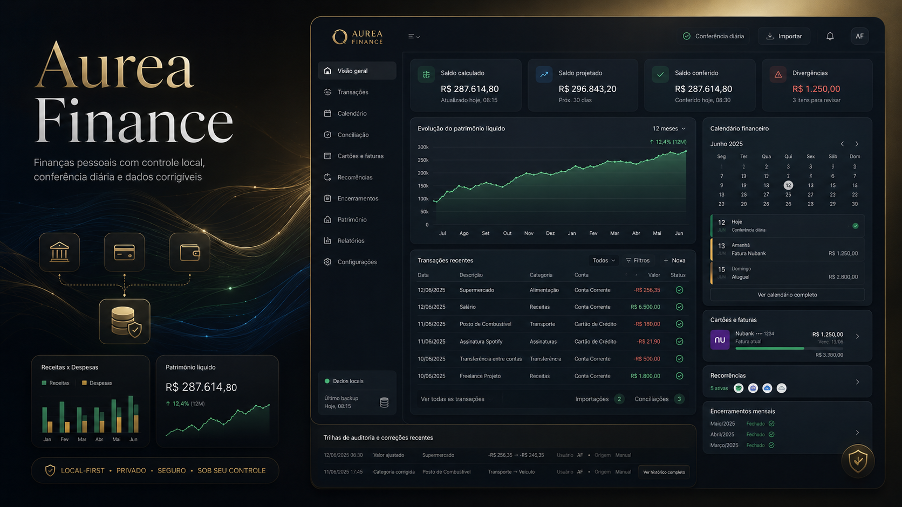
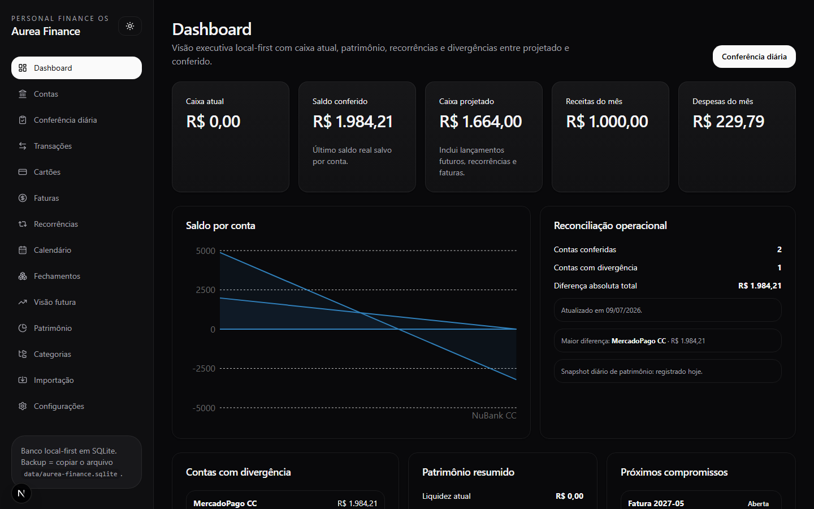
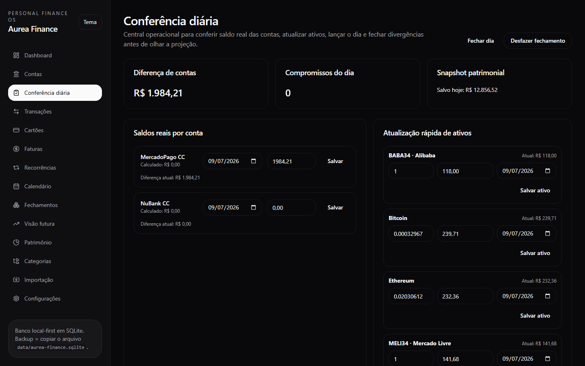
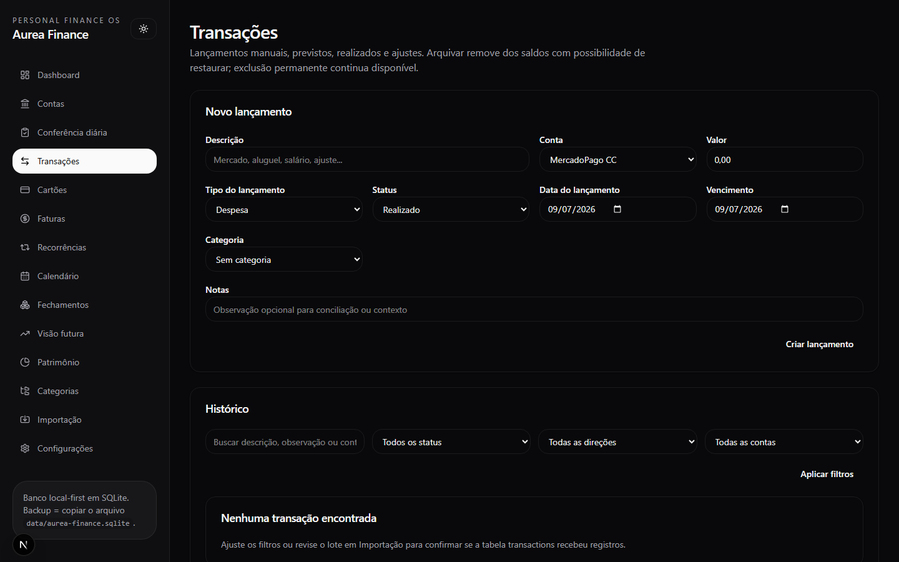
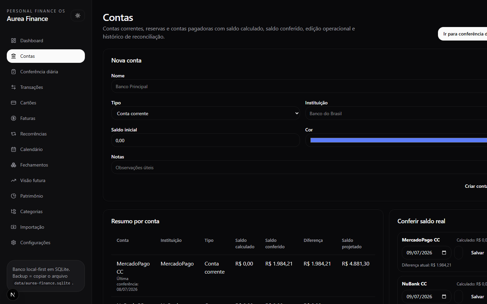
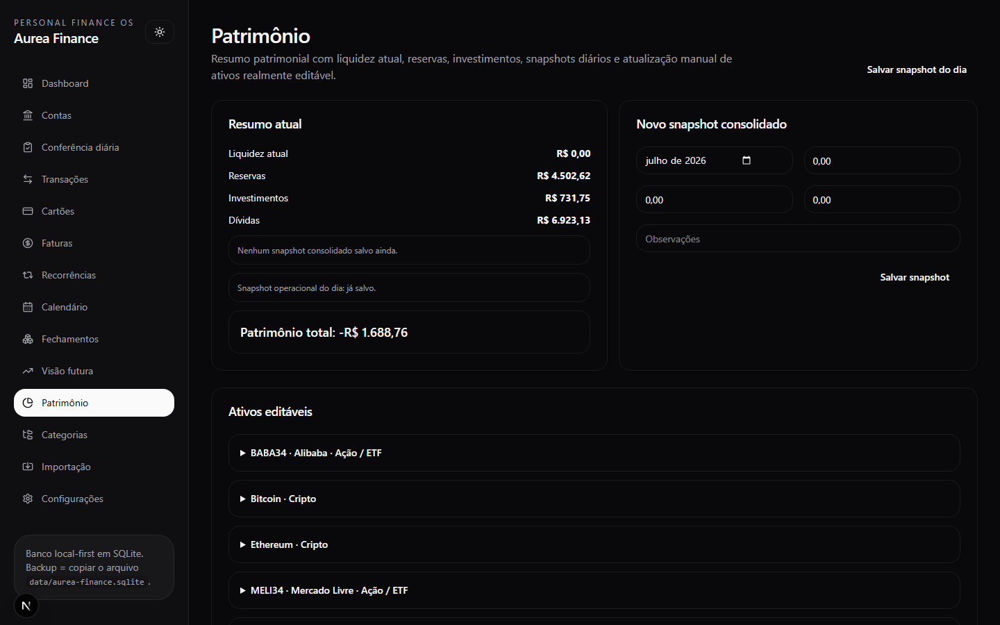
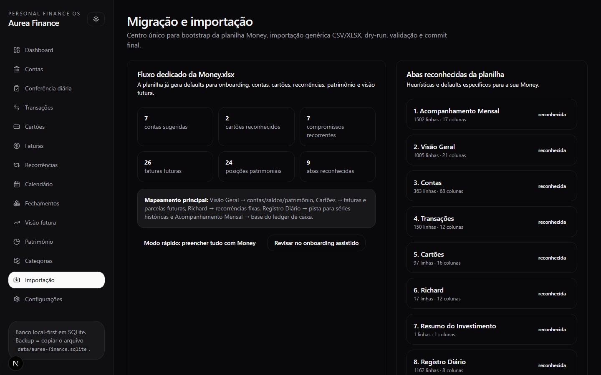

<div align="center">
  

  <h1>Aurea Finance</h1>

  <p><strong>Finanças pessoais local-first com conferência diária, orçamento, patrimônio e rastreabilidade operacional.</strong></p>
  <p><strong>Local-first personal finance with daily reconciliation, budgeting, net worth and operational traceability.</strong></p>

  <p>
    <a href="#-visão-geral--overview">PT-BR / English Overview</a> •
    <a href="#-product-preview">Preview</a> •
    <a href="#-screenshots">Screenshots</a> •
    <a href="#-stack--tecnologias">Stack</a> •
    <a href="#-arquitetura--architecture">Architecture</a> •
    <a href="#-quick-start--início-rápido">Quick Start</a> •
    <a href="#-autor--author">Author</a>
  </p>

  <p>
    
    
    
    
    
    
  </p>
</div>

<p align="center">
  
</p>

---

## 1. Visão Geral / Overview

O **Aurea Finance** é um sistema web de finanças pessoais criado para substituir uma planilha operacional (`Money.xlsx`) por um produto local-first, auditável e corrigível pela interface.

Ele transforma o fluxo real de controle financeiro — contas, cartões, recorrências, orçamento, patrimônio, importação e conferência diária — em uma experiência de software madura, com regras de domínio explícitas, SQLite local e forte ênfase em rastreabilidade.

O projeto foi desenvolvido por **Felipe Alirio Baruja** como peça âncora de portfólio, combinando engenharia full-stack, design de produto e modelagem financeira aplicada ao uso diário.

> **Local-First Notice**  
> O Aurea Finance foi desenhado para operar com banco SQLite local. Ele prioriza privacidade, backup manual, corrigibilidade e previsibilidade operacional — não depende de cloud para a operação principal.

---

## ✨ Product Preview

<p align="center">
  
</p>

O Aurea Finance apresenta uma experiência premium focada em operação diária: caixa atual vs. conferido vs. projetado, alertas de divergência, orçamento por categoria, patrimônio e navegação clara entre os módulos financeiros.

---

## 2. Por que este projeto importa? / Why this project matters

* **Planilhas são a realidade:** A maioria dos controles financeiros pessoais começa em Excel. Saber extrair regras, limpar inconsistências e transformar isso em software é uma habilidade crítica.
* **Projeção não é realidade:** O Aurea separa saldo calculado, saldo projetado e saldo conferido — evitando a armadilha clássica de tratar previsão como caixa.
* **Corrigibilidade operacional:** Dados importados, categorias duplicadas, ativos e cartões podem ser corrigidos pela UI, sem hardcode nem intervenção no código.
* **Masterpiece de Engenharia:** Substitui abas soltas e fórmulas frágeis por domínio tipado, migrations, testes e uma experiência de produto real.

---

## 🧠 O diferencial do Aurea Finance / What makes Aurea Finance different

### Português
O Aurea Finance não é um dashboard bonito sem utilidade. Ele combina operação diária, orçamento, cartões, recorrências e patrimônio em um sistema local-first com regras explícitas.

Ele mostra não apenas números, mas também:
- o que foi calculado a partir das movimentações;
- o que está projetado para o futuro;
- o que foi conferido manualmente como realidade;
- onde há divergência que exige ação;
- como a planilha original foi mapeada para entidades;
- como corrigir dados sem quebrar o histórico.

### English
Aurea Finance is not just a pretty dashboard. It combines daily operations, budgeting, cards, recurrences and net worth into a local-first system with explicit domain rules.

It shows not only numbers, but also:
- what was calculated from movements;
- what is projected for the future;
- what was manually reconciled as reality;
- where divergence requires action;
- how the original spreadsheet maps into entities;
- how to correct data without breaking history.

---

## 🎯 Problema que resolve / The problem it solves

Em controles financeiros reais baseados em planilha, costumam aparecer:
- saldos que não batem com a realidade;
- cartões e faturas difíceis de reconciliar;
- parcelamentos espalhados;
- recorrências pouco controláveis;
- patrimônio atualizado sem histórico confiável;
- categorias duplicadas;
- importações difíceis de revisar;
- falta de separação entre saldo calculado, projetado e conferido;
- fórmulas frágeis e gambiarras acumuladas.

O **Aurea Finance** cria uma camada estruturada entre a planilha legada e a operação financeira diária.

---

## 🧩 Proposta / Product Pipeline

O Aurea processa a operação financeira e entrega uma visão estruturada de caixa, orçamento, compromissos e patrimônio:

```txt
Money.xlsx / CSV / XLSX
  ↓
Parser + mapeamento de abas/colunas
  ↓
Staging + dry-run + validação
  ↓
Commit para SQLite (Drizzle)
  ↓
Domínio financeiro (centavos, transferências, cartões, recorrências)
  ↓
Conferência diária (calculado × projetado × conferido)
  ↓
Dashboard, orçamento, futuro, patrimônio e fechamentos
```

---

## 📸 Screenshots

<table>
  <tr>
    <td width="50%">
      
      <br />
      <sub><strong>Dashboard</strong> — caixa atual, conferido, projetado, receitas/despesas e alertas operacionais.</sub>
    </td>
    <td width="50%">
      
      <br />
      <sub><strong>Conferência Diária</strong> — saldos reais, ativos e fechamento do dia com divergências explícitas.</sub>
    </td>
  </tr>
  <tr>
    <td width="50%">
      
      <br />
      <sub><strong>Transações</strong> — receitas, despesas, filtros, edição e categorização operacional.</sub>
    </td>
    <td width="50%">
      
      <br />
      <sub><strong>Contas</strong> — saldo calculado vs. conferido, liquidez e composição do caixa.</sub>
    </td>
  </tr>
  <tr>
    <td width="50%">
      
      <br />
      <sub><strong>Patrimônio</strong> — reservas, ações, cripto, snapshots e evolução patrimonial.</sub>
    </td>
    <td width="50%">
      
      <br />
      <sub><strong>Importação</strong> — bootstrap da Money.xlsx, staging, dry-run e commit revisável.</sub>
    </td>
  </tr>
</table>

---

## 📄 Planilha de origem / Source workbook

A planilha original `Money.xlsx` é a fonte de descoberta do produto. No repositório público ela **não** é versionada (dados pessoais). Localmente, o fluxo esperado é:

1. colocar `Money.xlsx` em `data/Money.xlsx` (ou importar pela UI);
2. usar o bootstrap/import workbench;
3. revisar staging antes do commit;
4. corrigir divergências pelas telas operacionais.

Documentação da leitura da origem: [`docs/planilha-origem.md`](./docs/planilha-origem.md).

---

## 📌 Estudo de Caso / Case Study

### 📌 Estudo de Caso: Migração da Money.xlsx
A planilha original concentra acompanhamento mensal, visão geral, contas, cartões, investimentos, registro diário e planner pessoal em abas heterogêneas. O Aurea Finance normaliza isso em entidades tipadas: contas, transações, cartões/faturas, recorrências, orçamento, ativos e snapshots patrimoniais.

O pipeline de importação faz staging, dry-run e commit revisável. Depois do import, a operação diária passa a girar em torno da **conferência** — não da fórmula da planilha.

### 📌 Case Study: Money.xlsx Migration
The original workbook mixes monthly tracking, overview, accounts, cards, investments, daily registers and a personal planner across heterogeneous sheets. Aurea Finance normalizes that into typed entities: accounts, transactions, cards/invoices, recurrences, budgets, assets and net-worth snapshots.

The import pipeline stages, dry-runs and commits with review. After import, daily operation revolves around **reconciliation** — not spreadsheet formulas.

---

## 🧭 Visual Story / Jornada Operacional

A experiência do Aurea foi pensada como uma jornada financeira guiada:
```txt
1. Importar Money.xlsx / CSV ou iniciar com seed
2. Revisar staging e confirmar o commit
3. Abrir a Conferência Diária e salvar saldos reais
4. Atualizar posições patrimoniais
5. Registrar receitas, despesas e transferências
6. Revisar cartões, faturas e recorrências
7. Acompanhar orçamento e visão futura
8. Fechar o mês e inspecionar evolução patrimonial
```

---

## ⚙️ Funcionalidades Principais / Core Features

### Dashboard financeiro
Painel executivo com caixa atual, saldo conferido, caixa projetado, receitas/despesas do mês, alertas e atalhos para correção.

### Conferência diária
Fluxo central do produto: registrar saldos reais, atualizar ativos, revisar divergências e fechar o dia com segurança operacional.

### Transações
Receitas, despesas, transferências, categorias, tags, observações, filtros e edição operacional.

### Contas e liquidez
Contas correntes, reservas e saldos calculados vs. conferidos, com leitura clara de composição.

### Cartões e faturas
Compras, parcelamentos, limites, composição de fatura e vínculo com a conta pagadora.

### Recorrências e futuro
Séries recorrentes, materialização de eventos, calendário financeiro e projeção de compromissos.

### Orçamento mensal
Metas por categoria, realizado vs. previsto, progresso visual e leitura acionável de excessos.

### Patrimônio
Reservas, ações, cripto, snapshots, evolução e correção de posições pela UI.

### Importação
Parser/workbench para Money.xlsx e planilhas genéricas, com staging, dry-run, validação e commit revisável.

---

## 🛠️ Stack / Tecnologias

### Frontend
- **Framework:** Next.js 15 (App Router) & React 19
- **Linguagem:** TypeScript
- **Estilização:** Tailwind CSS v4
- **Componentização & Gráficos:** shadcn-inspired UI & Recharts
- **Forms:** React Hook Form + Zod
- **Ícones:** Lucide Icons

### Persistência & Domínio
- **Database:** SQLite local-first
- **ORM:** Drizzle ORM
- **Import:** xlsx
- **Testes:** Vitest (85 testes passando)

---

## 🧱 Arquitetura / Architecture

O projeto adota um monolito modular local-first:

```text
AureaFinance/
├── app/                         # Next.js App Router (rotas, layouts, API)
│   ├── (workspace)/             # Área autenticada/operacional do produto
│   ├── onboarding/              # Onboarding e bootstrap
│   └── api/                     # Endpoints de importação/análise
│
├── components/                  # UI, charts, forms, dashboard blocks
├── features/                    # Fluxos por domínio (accounts, budget, import...)
├── services/                    # Regras e agregações financeiras
├── db/                          # Schema Drizzle, migrations, seed
├── lib/                         # Money, formatters, finance helpers
├── scripts/                     # migrate, seed, backup, doctor, import
├── tests/                       # Domínio e confiabilidade (Vitest)
├── docs/                        # Arquitetura, data model, planilha-origem
├── assets/                      # Ícone, hero, social preview e screenshots
├── data/                        # SQLite local (ignorado) + Money.xlsx local
└── README.md                    # Esta documentação
```

---

## 🧱 Visual Architecture

```txt
UI (App Router)
  ↓
Features / Server Actions
  ↓
Services (domínio financeiro)
  ↓
Drizzle + SQLite
  ↑
Import Workbench (staging → dry-run → commit)
```

Aurea Finance follows a traceable operational flow: spreadsheet or manual input enters the system, gets validated, persisted in cents, reconciled daily and exposed as dashboard, budget, future and net-worth views.

---

## 🔁 Data Flow Pipeline

```txt
Raw Input (Money.xlsx / CSV / UI)
  ↓
Parsing / Column Mapping
  ↓
Staging Tables
  ↓
Validation + Dry-run
  ↓
Commit (SQLite transaction)
  ↓
Domain Rules (cents, dual-entry transfers, cards, recurrences)
  ↓
Daily Reconciliation (calculated × projected × checked)
  ↓
Dashboard / Budget / Future / Net Worth / Closings
```

---

## 🚀 Quick Start / Início Rápido

### Pré-requisitos
- **Node.js** v20 ou superior
- **pnpm** (o projeto declara `packageManager: pnpm@10.6.1`)
- **Git**
- Permissão de leitura/escrita em `data/`

### Instalação

```bash
corepack enable
corepack prepare pnpm@10.6.1 --activate
pnpm install
pnpm approve-builds
```

### Banco e seed

```bash
pnpm dbmigrate
pnpm dbseed
```

### Desenvolvimento

```bash
pnpm dev
```

Aplicação em [http://localhost:3000](http://localhost:3000).

### Build de produção

```bash
pnpm build
pnpm start
```

### Deploy (Vercel)

1. Conecte o repositório no Vercel.
2. Use Node 20+.
3. Build command: `pnpm build`.
4. Lembre que o SQLite local-first é o modo principal; para produção cloud, planeje storage persistente ou adapte a persistência.

---

## 🧪 Scripts e Testes / Scripts and Testing

```bash
pnpm typecheck    # TypeScript estrito (app + tests)
pnpm test         # Vitest — 85 testes / 10 arquivos
pnpm build        # Build de produção Next.js
pnpm db:doctor    # Diagnóstico do banco local
pnpm db:backup    # Backup operacional do SQLite
```

| Command | Purpose |
|---|---|
| `pnpm dbmigrate` | Aplica migrations |
| `pnpm dbseed` | Popula base demo |
| `pnpm db:import-csv` | Importação CSV operacional |
| `pnpm db:restore` | Restaura backup |

---

## 📊 Modelagem financeira / Financial methodology

O Aurea Finance usa regras explícitas de domínio:
* **Centavos inteiros:** dinheiro nunca circula como float.
* **Transferências em dupla entrada:** origem e destino controlados.
* **Cartão ≠ conta corrente:** fatura e caixa são conceitos separados.
* **Parcelas pré-geradas:** vinculadas a faturas e competência.
* **Recorrências materializadas:** sem corromper histórico.
* **Tríade de saldo:** calculado × projetado × conferido.

---

## 🛡️ Segurança, privacidade e boas práticas

* **Local-first:** o banco principal fica sob controle do usuário.
* **Sem Money.xlsx no Git público:** a planilha real contém dados pessoais e é ignorada.
* **`.env` e SQLite ignorados:** apenas exemplos e schema versionados.
* **Corrigibilidade:** preferência por soft delete / archive quando faz sentido.
* **Import revisável:** staging + dry-run antes do commit.

---

## 🧭 Roadmap do Produto

* **Fase 0 — Fundação:** schema, migrations, seed e shell do produto.
* **Fase 1 — Operação diária:** dashboard, contas, transações e conferência.
* **Fase 2 — Cartões & recorrências:** faturas, parcelas e materialização futura.
* **Fase 3 — Patrimônio & orçamento:** snapshots, metas e alertas.
* **Fase 4 — Importação Money.xlsx:** parser, staging, dry-run e commit.
* **Próximas evoluções:** performance de agregações, trilha de auditoria mais profunda, storage cloud opcional e screenshots de produto atualizados.

---

## 💼 Valor para Portfólio / Portfolio Value

O Aurea Finance demonstra competências críticas para funções de **Full-Stack Engineering, Product Engineering e FinTech pessoal**:
- **Design de Produto Financeiro:** tradução de planilha real em fluxos operacionais.
- **Domínio tipado:** regras financeiras testáveis e explícitas.
- **Arquitetura local-first:** SQLite + Drizzle com migrations e backup.
- **UX de correção:** o sistema tolera erro humano e importação imperfeita.

---

## 📚 Documentação Complementar

- [docs/architecture.md](./docs/architecture.md) — arquitetura e camadas
- [docs/data-model.md](./docs/data-model.md) — modelagem de dados
- [docs/planilha-origem.md](./docs/planilha-origem.md) — leitura da Money.xlsx
- [docs/migration-plan.md](./docs/migration-plan.md) — plano de migração
- [docs/design-system.md](./docs/design-system.md) — direção visual
- [docs/beginner-setup.md](./docs/beginner-setup.md) — setup para iniciantes
- [docs/troubleshooting.md](./docs/troubleshooting.md) — problemas comuns
- [docs/interview-prep.md](./docs/interview-prep.md) — roteiro de entrevista
- [docs/roadmap.md](./docs/roadmap.md) — evolução do produto

---

## 🖼️ GitHub Social Preview

Uma imagem para visualização social está disponível em:
```txt
assets/social-preview.png
```
*Dimensão recomendada: 1280x640, <1MB. Faça upload em: Repository Settings → Social Preview.*

---

## 🔖 GitHub Repository Metadata

### About sugerido
```txt
Local-first personal finance OS: daily reconciliation, budgeting, cards, net worth and Money.xlsx import — Next.js + SQLite + Drizzle.
```

### Topics sugeridos
```txt
personal-finance
local-first
nextjs
typescript
sqlite
drizzle-orm
budgeting
net-worth
fintech
portfolio-project
recharts
react
tailwindcss
spreadsheet-import
```

---

## 👤 Autor / Author

Desenvolvido por **Felipe Alirio Baruja**.

- **Portfolio:** [barujafe.vercel.app](https://barujafe.vercel.app/)
- **GitHub:** [@BarujaFe1](https://github.com/BarujaFe1)
- **LinkedIn:** [Gustavo Felipe Alirio Baruja](https://www.linkedin.com/in/barujafe/)

---

## 📄 Licença / License

MIT License. Copyright (c) 2026 Felipe Alirio Baruja.
O código está disponível sob a licença MIT — veja o arquivo [`LICENSE`](./LICENSE).
