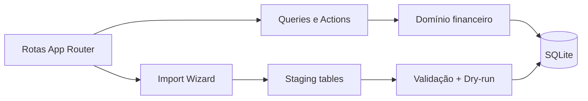

# Arquitetura

## Visão geral

Aurea Finance adota um **monolito modular local-first**.

- **UI**: Next.js App Router + Tailwind + componentes inspirados em shadcn/ui
- **Domínio**: regras explícitas em `lib/domain/*`
- **Persistência**: Drizzle ORM + SQLite local
- **Importação**: pipeline desacoplado em `features/import/services/*`
- **Gráficos**: Recharts

## Motivos da escolha

1. Menos fricção para dev solo.
2. Sem custo obrigatório de infraestrutura.
3. Banco fácil de copiar, versionar como backup manual e entender.
4. Separação suficiente entre domínio, dados, importação e interface, sem excesso de camadas.

## Fluxo principal

## Regras-chave

- dinheiro sempre em centavos inteiros
- transferências em dupla entrada controlada
- cartão de crédito separado de conta corrente
- parcelas pré-geradas e vinculadas a faturas
- recorrências geram ocorrências sem corromper histórico
- fechamento mensal consolidado e legível
- dia financeiro = calendário local (`todayIso`), não `toISOString().slice(0,10)`

## Camadas

| Camada | Pasta | Responsabilidade |
|---|---|---|
| UI / rotas | `app/`, `components/` | App Router, shell, formulários, gráficos |
| Features | `features/*` | Server Actions + queries por domínio |
| Services | `services/` | Orquestração e persistência |
| Domínio puro | `lib/domain/*`, `lib/finance.ts`, `lib/money.ts` | Regras testáveis sem I/O |
| Persistência | `db/` | Schema Drizzle, client SQLite, migrations |
| Import | `features/import`, `services/*import*` | Staging, dry-run, bootstrap sintético |

Documentos relacionados: [`TECHNICAL_DECISIONS.md`](./TECHNICAL_DECISIONS.md), [`DEPLOYMENT.md`](./DEPLOYMENT.md), [`TESTING.md`](./TESTING.md).
