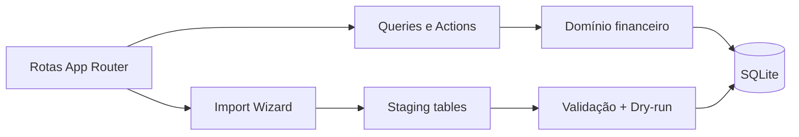

# Arquitetura

## Visão geral

Aurea Finance adota um **monolito modular local-first**.

- **UI**: Next.js App Router + Tailwind + componentes inspirados em shadcn/ui
- **Domínio**: regras explícitas em `lib/domain/*`
- **Persistência**: Drizzle ORM + SQLite local
- **Importação**: pipeline desacoplado em `features/import/services/*`
- **Gráficos**: Recharts

## Motivos da escolha

1. Menos fricção para dev solo.
2. Sem custo obrigatório de infraestrutura.
3. Banco fácil de copiar, versionar como backup manual e entender.
4. Separação suficiente entre domínio, dados, importação e interface, sem excesso de camadas.

## Fluxo principal

## Regras-chave

- dinheiro sempre em centavos inteiros
- transferências em dupla entrada controlada
- cartão de crédito separado de conta corrente
- parcelas pré-geradas e vinculadas a faturas
- recorrências geram ocorrências sem corromper histórico
- fechamento mensal consolidado e legível
